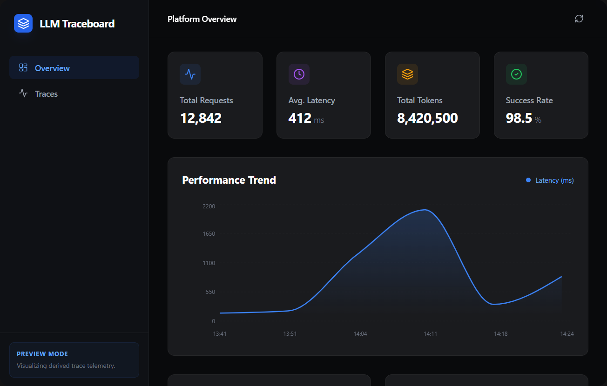
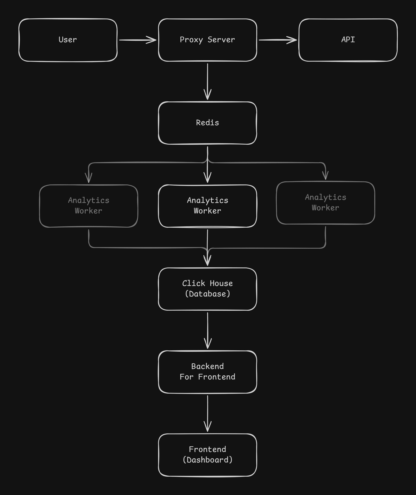

# LLM Observability Platform

<p align="center">
   
</p>

A comprehensive, multi-service platform to monitor and secure LLM applications in production. Built with a focus on mitigating prompt injections, detecting PII leakage, calculating token costs, and providing high-performance observability insights.

## Project Architecture

The platform follows a microservices architecture to ensure scalability and separation of concerns.

- **Proxy Service**: A FastAPI-based proxy that handles real-time LLM requests. It performs synchronous safety checks (Prompt Injection Detection, PII Redaction) before forwarding valid requests to the underlying LLM (e.g., OpenAI). It also logs all interactions to Redis asynchronously.
- **Analytics Worker**: A Python worker process that subscribes to the Redis logging channel. It performs heavier asynchronous tasks such as token counting and cost calculation, and inserts structured logs into ClickHouse.
- **BFF (Backend-For-Frontend) Service**: A FastAPI service that serves the frontend dashboard by running analytical queries on ClickHouse data.
- **Frontend Dashboard**: A React/Vite-based modern UI that provides visualizations of metrics (Latency, Costs, Requests) and displays traces.
- **ClickHouse**: The core analytics database for high-performance log querying.
- **Redis**: Serves as an asynchronous message queue (Pub/Sub) between the Proxy Service and the Analytics Worker.

<p align="center">
   
</p>

## Prerequisites

- [Docker and Docker Compose](https://docs.docker.com/get-docker/)
- Required environment variables set in `.env` (check `.env.example`).

## Quick Start

1. Create a `.env` file by copying `.env.example` and filling in the required values (e.g., your test `LLM_API_KEY`).
   ```bash
   cp .env.example .env
   ```
2. Start the entire platform using Docker Compose. It will build the individual services and initialize the database.
   ```bash
   docker-compose up --build
   ```
3. The platform will be accessible at:
   - **Frontend Dashboard**: [http://localhost:3000](http://localhost:3000)
   - **Proxy Service API**: `http://localhost:8000` (Use for OpenAI-compatible chat completion requests)
   - **BFF Service API**: `http://localhost:8001`

Check the individual directories for detailed service READMEs:
- [`/proxy_service/README.md`](./proxy_service/README.md)
- [`/analytics_worker/README.md`](./analytics_worker/README.md)
- [`/bff_service/README.md`](./bff_service/README.md)
- [`/frontend/README.md`](./frontend/README.md)
